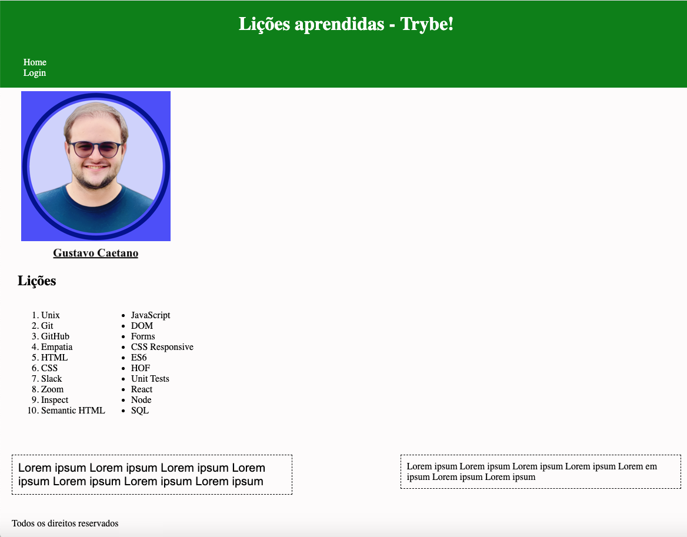

<!-- markdownlint-disable MD033 -->

# `Lições Aprendidas` 📚

Boas-vindas ao repositório `Lições Aprendidas`.

Para realizar o desenvolvimento proposta nessa atividade, atente-se a cada passo descrito;

Aqui, você vai encontrar os detalhes de como estruturar seu desenvolvimento a partir desse repositório, utilizando uma branch específica e um _Pull Request_ para colocar seus códigos.

## 🧑‍💻 O que deverá ser desenvolvido

Você vai desenvolver um site com uma série de informações sobre o que você aprendeu aqui na Trybe ao longo dos últimos conteúdos. O seu site deverá estar com elementos posicionados e estilizados e, além disso, deverá conter semântica apropriada para que seja acessível e melhor ranqueado.

<details>
  <summary>🖼️ 💡Veja no exemplo a seguir como pode ser a aparência do projeto depois de pronto. Lembre-se de que você pode e deve ir além para deixar o projeto com a sua cara e impressionar todas as pessoas!</summary>
  
</details>

## Como Desenvolver

<details>
<summary><strong>🤷🏽‍♀️ Como corrigir automaticamente?</strong></summary>

Para corrigir o seu desenvolvimento através do avaliador automático, você deverá criar um _Pull Request_ neste repositório.

</details>
  
<details>
  <summary><strong>Habilidades a serem trabalhadas</strong></summary>

Você deve desenvolver uma página HTML estilizada com CSS.

Através desta aplicação, será possível realizar a construção de código HTML, posicionamento e estilização CSS.

</details>

<details>
<summary>‼️ Antes de começar a desenvolver</summary>

1. Clone o repositório

   - Copie o endereço SSH do repositório e use-o para cloná-lo em sua máquina:
     - Por exemplo: `git clone git@github.com:tryber/xxxx.git`.

     <details><summary>🖼️ Local do endereço SSH na página inicial do repositório:</summary>

     

     </details>
   - Entre no diretório do repositório que você acabou de clonar:
     - `cd <diretório-do-repo>`

2. Crie uma branch a partir da branch `main`

   - Verifique que você está na branch `main`
     - Exemplo: `git branch`
   - Se não estiver, mude para a branch `main`
     - Exemplo: `git checkout main`
   - Agora crie uma branch à qual você vai submeter os `commits` do seu desenvolvimento
     - Exemplo: `git checkout -B joãozinho-xxx`

3. Para cada etapa do desenvolvimento, adicione as mudanças ao _stage_ do Git e faça um `commit`

   - Verifique que as mudanças ainda não estão no _stage_
     - Exemplo: `git status` (devem aparecer listadas as alterações realizadas em vermelho)
   - Adicione o novo arquivo ao _stage_ do Git
     - Exemplo:
       - `git add .` (adicionando todas as mudanças - _que estavam em vermelho_ - ao stage do Git)
       - `git status` (devem aparecer listadas as alterações realizadas em verde)
   - Faça o `commit` inicial
     - Exemplo:
       - `git commit -m 'Iniciando o desenvolvimento X! #VQV 🚀'` (fazendo o primeiro commit)
       - `git status` (deve aparecer uma mensagem tipo _nothing to commit_ )

4. Adicione a sua branch com o novo `commit` ao repositório remoto

   - Usando o exemplo anterior: `git push -u origin joãozinho-sd-0x-project-x`

5. Crie um novo `Pull Request` _(PR)_

   - Vá até a página de _Pull Requests_ do repositório no GitHub.
      <details><summary>🖼️ Local da página de Pull Requests no repositório:</summary>

     

     </details>
   - Clique no botão verde _"New pull request"_
   - Clique na caixa de seleção _"Compare"_ e escolha a sua branch **com atenção**
   - Clique no botão verde _"Create pull request"_
   - Adicione uma descrição para o _Pull Request_ e clique no botão verde _"Create pull request"_
   - **Não se preocupe em preencher mais nada por enquanto!**
   - Volte até a página de _Pull Requests_ do repositório e confira que o seu _Pull Request_ está criado

</details>

<details>
<summary>⌨️ Durante o desenvolvimento</summary>

- Faça `commits` das alterações que você fizer no código regularmente

- Lembre-se de sempre após um (ou alguns) `commits` atualizar o repositório remoto

- Os comandos que você utilizará com mais frequência são:
    1. `git status` _(para verificar o que está em vermelho - fora do stage - e o que está em verde - no stage)_
    2. `git add` _(para adicionar arquivos ao stage do Git)_
    3. `git commit` _(para criar um commit com os arquivos que estão no stage do Git)_
    4. `git push -u nome-da-branch` _(para enviar o commit para o repositório remoto na primeira vez que fizer o `push` de uma nova branch)_
    5. `git push` _(para enviar o commit para o repositório remoto após o passo anterior)_

</details>

## Orientações

<details>
  <summary><strong>🛠 Testes</strong></summary><br />

Lembre-se de que sua página deverá conter semântica adequada. Para isso você pode verificar se a sua página está aprovada através do [CodeSniffer](https://squizlabs.github.io/HTML_CodeSniffer/).

Todos os requisitos do exercício serão testados **automaticamente** por meio do `Cypress`.

## Cypress

O Cypress é uma ferramenta de teste de front-end desenvolvida para a web.

Antes de utilizá-lo, certifique-se de ter executado o comando `npm install` dentro do exercício.

Você pode rodar o cypress localmente para verificar se seus requisitos estão passando, para isso execute o seguinte comando:

```bash
npm run cypress:open
```

Após executar o comando acima, será aberta uma janela de navegador e então basta clicar no nome do arquivo de teste que quiser executar (project.spec.js).

## Observações técnicas

Alguns requisitos devem seguir um padrão pré-estabelecido para que os testes automáticos funcionem corretamente, leia-os atentamente e siga à risca o que for pedido. Em particular, **atente-se para os nomes de _ids_ que alguns elementos devem possuir**.

- Os requisitos são avaliados automaticamente, sendo utilizada a resolução de tela de `1366 x 768` (1366 pixels de largura por 768 pixels de altura).

- ⚠️ Logo, recomenda-se desenvolver seu exercício usando a mesma resolução, via instalação [deste plugin](https://chrome.google.com/webstore/detail/window-resizer/kkelicaakdanhinjdeammmilcgefonfh?hl=en) do `Chrome` para facilitar a configuração da resolução.

- Atente-se para o tamanho das imagens que você utilizará. **Não utilize imagens com um tamanho maior que _500Kb_.**

- ⚠️ Utilize uma ferramenta [como esta](https://picresize.com/pt) para redimensionar as imagens.

- Caso a avaliação falhe com alguma mensagem de erro parecida com `[409:0326/130838.878602:FATAL:memory.cc(22)] Out of memory. size=4194304`, provavelmente as imagens que você está utilizando estão muito grandes. Tente redimensioná-las para um tamanho menor.

- Para verificar se a sua avaliação foi computada com sucesso, você pode verificar os **detalhes da execução do avaliador**.

- Na página do seu _Pull Request_, acima do "botão de merge", procure por _**"Evaluator job"**_ e clique no link _**"Details"**_;


- Na página que se abrirá, procure pela linha _**"Run Cypress Evaluator"**_ e clique nela;


  
- Desça a página até encontrar a mensagem _**"(Run Starting)"**_;


- Você tem liberdade para adicionar novos comportamentos ao seu exercício, seja na forma de aperfeiçoamentos em requisitos propostos ou novas funcionalidades, **desde que tais comportamentos adicionais não conflitem com os requisitos propostos**.

- Você pode fazer mais do que for pedido, mas nunca menos.

- **Nada além do que for pedido nos requisitos será avaliado**. _Esta é uma oportunidade de você exercitar a sua criatividade e experimentar com os conhecimentos adquiridos._

⚠️ **O avaliador automático não necessariamente avalia seu exercício na ordem em que os requisitos aparecem no readme. Isso acontece para deixar o processo de avaliação mais rápido. Então, não se assuste se isso acontecer, ok?**

### Executando todos os testes localmente

Você pode executar o projeto utilizando o comando:

```bash
npm test
```

### Executando um teste específico localmente

  {{Se há a possibilidade de rodar um teste apenas, descreva aqui}}

### Executando os testes no avaliador

  Os testes do avaliador rodam automaticamente quando você faz um `push` dentro da sua branch, caso haja um PR criado. O avaliador pode demorar a rodar, mas quando finalizar, você verá um comentário com os resultados do teste no seu PR.

  > **Atenção ⚠️: o avaliador automático não necessariamente avalia seu desenvolvimento na ordem em que os requisitos aparecem no readme. Isso acontece para deixar o processo de avaliação mais rápido. Então, não se assuste se isso acontecer, ok?**

</details>

## Requisitos

### 1. Adicione uma cor de fundo específica para a página

<details>
  <summary><strong>Mais informações:</strong></summary>

A página deve possuir a cor de fundo <code>rgb(253, 251, 251)</code> em seu corpo.

- **O que será testado:**

- A página deve possuir cor de fundo: `rgb(253, 251, 251)` em seu corpo.

</details>

### 2. Adicione uma barra superior com um título

<details>
  <summary><strong>Mais informações:</strong></summary>

Essa barra superior deve possuir o <code>id</code> igual a <code>cabecalho</code> e deve ser fixa no topo da página com a propriedade <code>top</code> tendo <code>0</code>. O título deve estar dentro da barra e ser um elemento <code>h1</code> com <code>id</code> igual a <code>titulo</code>.

- **O que será testado:**

- A barra deve possuir o ID `cabecalho`;
- A barra superior deve ser fixa no topo da página;
- A barra deve ter a propriedade `top` tendo o valor `0`;
- O título deve estar dentro da barra e possuir o ID `titulo`, além de ser uma tag `h1`.

</details>

### 3. Adicione uma foto sua à página

<details>
  <summary><strong>Mais informações:</strong></summary>

A foto deve ser inserida utilizando uma tag <code>img</code> com o ID <code>minha_foto</code>.

- **O que será testado:**

- A foto deve ser uma tag `img` e possuir o ID `minha_foto`.

</details>

### 4. Adicione uma lista de lições aprendidas à página

<details>
  <summary><strong>Mais informações:</strong></summary>

A lista deve possuir <strong>10</strong> itens, ser numerada e possuir o ID <code>licoes_aprendidas</code>.

- **O que será testado:**

- A lista deve ser numerada;

- A lista deve possuir o ID `licoes_aprendidas`;

- A lista deve possuir 10 itens.

</details>

### 5. Crie uma lista de lições que ainda deseja aprender para a página

<details>
  <summary><strong>Mais informações:</strong></summary>

A lista deve possuir <strong>10</strong> itens, não ser numerada e possuir o ID <code>licoes_a_aprender</code>.

- **O que será testado:**

- A lista não deve ser numerada;
  
- A lista deve possuir o ID `licoes_a_aprender`;

- A lista deve possuir 10 itens.

</details>

### 6. Adicione um rodapé para a página

<details>
  <summary><strong>Mais informações:</strong></summary>

O rodapé deve utilizar a tag <strong>footer</strong> e possuir o ID <code>rodape</code>.

- **O que será testado:**

- O rodapé deve possuir a tag `footer`;

- O rodapé deve possuir o ID `rodape`.

</details>

### 7. Insira pelo menos um link externo na página

<details>

<summary>Mais informações:</summary>

O link deve redirecionar a pessoa usuária para uma nova aba do navegador.

- **O que será testado:**

- O link deve ser aberto em nova aba no navegador.

</details>

### 8. Crie um artigo sobre o seu aprendizado

<details>
  <summary><strong>Mais informações:</strong></summary>

  O artigo deverá ser uma tag HTML `<article>` e deve possuir mais de 300 <strong>caracteres</strong> e menos de 600.

- **O que será testado:**

  - O artigo deve possuir a tag `<article>`.
  - O artigo deve ter mais de 300 caracteres e menos de 600.

</details>

### 9. Crie uma tag HTML `aside` que contenha uma breve descrição sobre você

<details>
  <summary><strong>Mais informações:</strong></summary>

  A tag `<aside>` deverá possuir mais de 100 <strong>caracteres</strong> e menos de 300.

- **O que será testado:**

  - A tag `aside` deve ser utilizada.
  - A sua descrição deve ter mais que 100 caracteres e menos que 300.

</details>

### 10. Aplique elementos HTML de acordo com o sentido e propósito de cada um deles

<details>
  <summary><strong>Mais informações:</strong></summary>

  A sua página deve conter os seguintes elementos: `<article>`, `<header>`, `<aside>`, e `<footer>`.

- **O que será testado:**

  - A página deve possuir um elemento `article`.
  - A página deve possuir um elemento `header`.
  - A página deve possuir um elemento `aside`.
  - A página deve possuir um elemento `footer`.

</details>

### 11. Teste a semântica da sua página usando o site [CodeSniffer](https://squizlabs.github.io/HTML_CodeSniffer/)

<details>
  <summary><strong>Mais informações:</strong></summary>

  Teste se a semântica da sua página está aprovada pelo site [CodeSniffer](https://squizlabs.github.io/HTML_CodeSniffer/).

- **O que será testado:**

  - A sua página deve passar com `0 errors` na verificação de semântica do site [CodeSniffer](https://squizlabs.github.io/HTML_CodeSniffer/).

</details>
